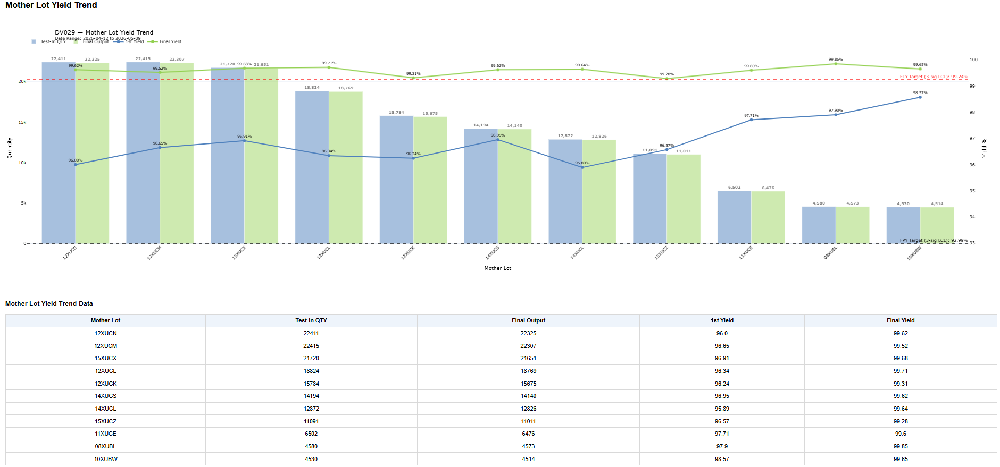
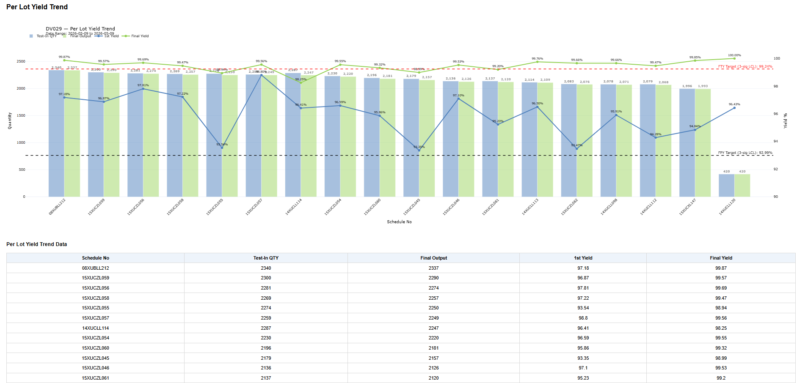

# SIP Yield Dashboard

> **Note:** All data, device names, handler names, stations, soft bins, errCodes, and identifiers shown in this repository have been fully anonymized for public portfolio usage. No proprietary manufacturing or customer-sensitive data is included.

Production-style semiconductor manufacturing analytics dashboard built using Streamlit, DuckDB, Python, SQL, and Plotly.

---

# Overview

This project is a production-style semiconductor manufacturing analytics dashboard built using:

- Python
- Streamlit
- DuckDB
- Pandas
- Plotly

The dashboard automates:
- raw test file ingestion
- ETL transformation
- KPI aggregation
- yield monitoring
- defect pareto generation
- retest analytics
- handler/site analysis
- automated HTML report exports

The analytics workflows were designed around semiconductor final-test manufacturing operations, including lot-level yield tracking, retest analysis, defect monitoring, and equipment-level performance investigation.

---

## Data Sources

The dashboard pipeline processes manufacturing production data originating from:
- raw `.txt` production logs
- `.log` equipment output files

The ETL pipeline standardizes and transforms these semi-structured files into analytics-ready DuckDB tables for downstream KPI monitoring and reporting.

---

# Core Features

## ETL / Data Engineering
- Automated raw text/CSV ingestion
- SQL-based analytical transformations
- DuckDB-based analytical warehouse
- Window-function based deduplication pipelines
- Incremental loader pipeline
- Automated HTML report generation
- Shared export automation
- Config-driven deployment architecture

## Manufacturing Analytics
- 4-week yield monitoring
- First Pass Yield (FPY)
- Final Test Yield (FTY)
- Lot Rejection Rate (LRR)
- Retest Pass Rate (RPR)
- Top defect pareto analysis
- Handler correlation analysis
- Handler-site root cause analysis

## Long-Term Manufacturing Trend Analytics
Includes:
- Year-over-Year (YoY) yield monitoring
- Quarter-over-Quarter (QoQ) trend analysis
- Month-over-Month (MoM) production analytics
- long-horizon defect trend visibility
- manufacturing performance comparison across periods

---

# Technology Stack

| Category | Tools |
|---|---|
| Language | Python |
| Query Language | SQL |
| Dashboard | Streamlit |
| Database | DuckDB |
| Data Processing | Pandas |
| ETL | Python + SQL |
| Visualization | Plotly |
| Automation | Windows Task Scheduler |
| Reporting | HTML Export |

---

# Dashboard Screenshots

---

# KPI Cards


Production KPI summary cards for:
- FPY(First Pass Yield)
- FTY(Final Test Yield)
- RPR(Retest Pass Rate)
- LRR(Lot Rejection Rate)
- input/output quantity tracking

---

# 4-Week Yield Trend


4-week rolling yield monitoring with:
- test-in quantity
- output quantity
- first yield
- final yield
- dynamic target tracking

---

# Top 5 Defect Distribution


Defect pareto analysis with:
- top defect contributors
- stacked defect rate monitoring
- FPY / FTY overlay trend visualization

---

# Mother Lot Yield Trend



Semiconductor mother-lot monitoring analytics used for:
- upstream process excursion tracking
- yield trend monitoring
- manufacturing root-cause investigation
- high-level production performance comparison

The dashboard supports rolling yield monitoring and defect visibility at mother-lot aggregation level.

Scope:
- summarized using rolling 4-week + recent 7-day production data
  
---

# Per Lot Yield Trend



Lot-level yield analytics supporting:
- related lot performance tracking
- abnormal yield detection
- retest investigation
- engineering containment workflows
- detailed lot-by-lot yield comparison

Provides detailed visibility into individual production schedule performance derived from mother-lot groupings.

Scope:
- focused on previous-day production monitoring for operational investigation workflows

---

# LRR Trend Monitoring


Lot Rejection Rate monitoring dashboard including:
- LRR %
- LRR lot counts
- historical trend tracking
- automatic trigger thresholds

---

# LRR Summary Table


Detailed LRR summary analytics with:
- affected lots
- mother lot visibility
- rolling 4-week aggregation

---

# Retest Pass Rate errCode Distribution


Retest recovery analytics showing:
- high RPR errCodes
- recovery contribution distribution
- defect recovery monitoring

---

# Handler vs RPR Analysis


Equipment-level analytics for:
- handler contribution analysis
- retest recovery comparison
- top errCode contributors per handler

---

# Handler-Site vs RPR Analysis


Root-cause isolation analytics using:
- handler-site combinations
- top recovery contributors
- high-risk site detection

---

# YoY Yield Trend


Year-over-Year yield comparison analytics.

---

# YoY Top 5 Defect Rate


Year-over-Year defect pareto monitoring.

---

# QoQ Yield Trend


Quarter-over-Quarter yield trend analytics.

---

# QoQ Top 5 Defect Rate


Quarter-over-Quarter defect distribution monitoring.

---

# MoM Yield Trend


Month-over-Month yield analytics.

---

# MoM Top 5 Defect Rate


Month-over-Month defect trend monitoring.

# Architecture & Technology Decisions

## Why DuckDB

DuckDB was selected as the primary analytics database because it provides:

- lightweight deployment
- fast analytical query performance
- minimal infrastructure overhead
- embedded SQL analytics capability
- easy portability within restricted enterprise environments

The project environment had limitations on deploying and managing heavier database platforms such as SQL Server or PostgreSQL, so DuckDB provided a highly effective local analytics solution for manufacturing KPI workloads.
---

## Why Streamlit

Streamlit was selected because it enabled rapid development of interactive analytics dashboards without requiring enterprise BI licensing or additional infrastructure.

Benefits included:

- lightweight deployment
- Python-native integration
- rapid visualization development
- standalone HTML export generation
- simplified maintenance for internal reporting workflows

This allowed the dashboard to function as a practical alternative for internal manufacturing analytics and reporting under constrained tooling environments.

---

# Repository Structure

```text
SIP_Dashboard_GitHub/
│
├── screenshots/
├── src/
├── docs/
├── README.md
